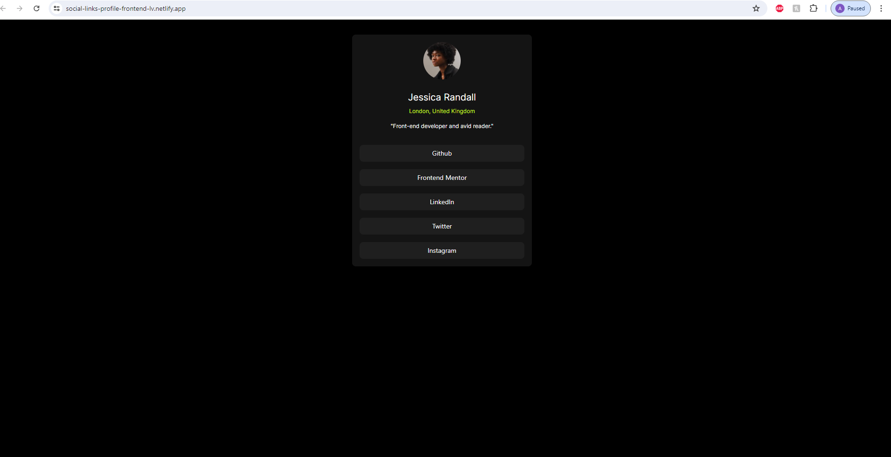
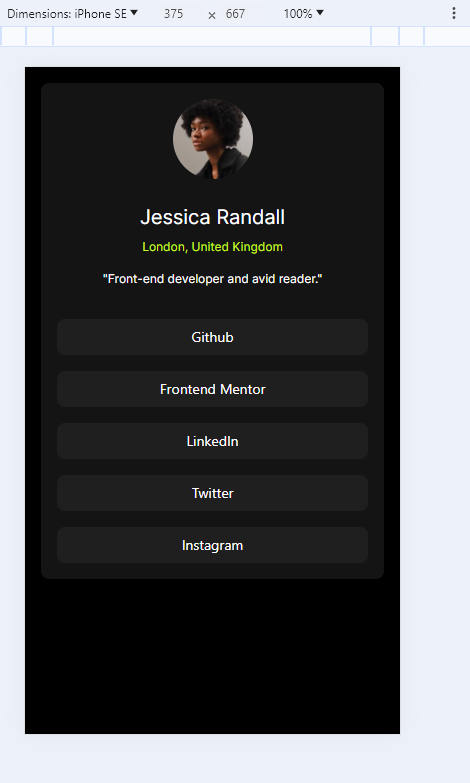

# Social Links Profile Website

This project involved creating a replica of a social links profile website, adhering strictly to a provided design. The challenge was to match the design 1:1 without any additional guidance on the code or frameworks to be used. The primary technologies leveraged for this project were ReactJS, JavaScript, TailwindCSS, and Vite.

This is a solution to the [Social links profile challenge on Frontend Mentor](https://www.frontendmentor.io/challenges/social-links-profile-UG32l9m6dQ). Frontend Mentor challenges help you improve your coding skills by building realistic projects. 

## Table of contents

- [Overview](#overview)
  - [The challenge](#the-challenge)
  - [Screenshot](#screenshot)
  - [Links](#links)
- [My process](#my-process)
  - [Built with](#built-with)
  - [Continued development](#continued-development)
  - [Useful resources](#useful-resources)
- [Author](#author)

## Overview

The project's scope involved developing a social links profile website page using ReactJS, Tailwind CSS, JavaScript, and Vite. I was provided with a collection of assets, including design examples, images, and fonts. The image was provided was of the profile page individual. The fonts used were from Google Fonts. The website featured a profile picture, the individual's name and location, a quote about them and five button links to various social media pages. The project required a precise understanding of tailwindCSS, flex box and design.

### The challenge

Users should be able to:
- See hover and focus states for all interactive elements on the page
- Mobile responsive design
- Color combination match to design presented
- User's profile picture displayed
- User's name, location and quote displayed

### Screenshot

### Links

- Solution URL: [Add solution URL here](https://your-solution-url.com)
- Live Site URL: [Social Links Profile Netlify Website](https://social-links-profile-frontend-lv.netlify.app/)

## My Process

### Built with

- Semantic HTML5 markup
- CSS custom properties
- Flexbox
- CSS Grid
- Mobile-first workflow
- [React](https://reactjs.org/) - JS library
- Google Fonts

### Continued development

Based on this project, I will continue to hone my web development skills, knowledge and understanding of coding. 

### Useful resources

- [Google Fonts](https://fonts.google.com/specimen/Inter) - This Google Font was the required font for the project. I used this and embedded it in my head of my index html as well as my Tailwind config file.

## Author

- Website - [Laura Vollmer](https://lauradeveloper.com/)
- Frontend Mentor - [@lavollmer](https://www.frontendmentor.io/profile/lavollmer)
- Github - [@lavollmer](https://github.com/lavollmer)

